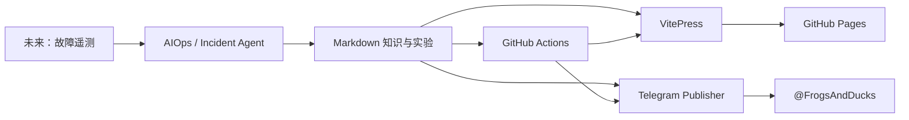

# Cloud Native AIOps Performance Lab

面向生产环境与高级工程岗位的 Linux 性能、云原生、可观测性和 AIOps 实战知识库。

这个项目不以“收集命令”为目标，而是持续形成：

- 可解释的系统原理；
- 可复现的故障实验；
- 有证据链的排障 SOP；
- 可复用的生产案例；
- 可以在面试中清晰表达的项目故事；
- Telegram 间隔复习与后续 AIOps Agent 能力。

## 当前内容

- Linux CPU 性能
- Linux 内存性能
- Linux 网络性能
- 综合性能事故 SOP
- 动态追踪与可观测性
- 性能实战面试手册
- 持续学习路线

## 架构



## 本地运行

要求 Node.js 20 或更新版本，以及 pnpm。

```bash
pnpm install
pnpm docs:dev
```

构建验证：

```bash
pnpm docs:build
```

## Telegram 预览

不需要 Token，不会发送消息：

```bash
pnpm telegram:preview -- \
  --file docs/performance-engineering/cpu/index.md
```

正式发送前，通过环境变量配置：

```bash
export TELEGRAM_BOT_TOKEN='...'
export TELEGRAM_CHAT_ID='@FrogsAndDucks'

pnpm telegram:publish -- \
  --file docs/performance-engineering/cpu/index.md
```

真实 Token 只能存放在本地环境变量或 GitHub Actions Secrets 中。

## GitHub Actions

- `pages.yml`：推送到 `main` 后构建并发布 GitHub Pages。
- `telegram.yml`：手动选择文章，先预览或正式推送频道。
- 正式博客域名：<https://ai.buleye.com>。
- `telegram-sync.yml`：轮询频道内容、执行 AI 指令，并处理候选内容审批。
- `industry-digest.yml`：每天 08:00 生成行业双语简报候选。
- `english-lesson.yml`：每天 20:30 生成技术英语候选。

候选内容先私聊发送到 `TELEGRAM_ADMIN_USER_ID`，只有点击“收录博客”后才会进入公开博客。

频道触发词：

| 指令 | 行为 |
| --- | --- |
| `#思考 内容` | 原样收录到思考日志 |
| `#面试 内容` | 原样收录到思考日志并标记为面试 |
| `#总结 URL或材料` | 区分事实、观点和待验证信息，生成摘要候选 |
| `#写作 主题或材料` | 生成结构化技术文章候选 |
| `#复盘 事故记录` | 生成根因、处置、改进和 SOP 候选 |
| `#见解 主题或材料` | 生成正反观点、关键假设和生产建议候选 |

AI 指令使用主线路、备用线路和 OpenAI 线路依次降级。同一条频道
消息按 `message_id` 去重，工作流重试不会重复生成候选。

第一阶段刻意不设置自动群发，避免提交测试时刷屏。发布格式稳定后，再增加间隔复习计划。

## 作品集路线

```text
性能知识库
→ 可复现故障实验
→ Prometheus/Grafana/eBPF 证据链
→ 自动事件包
→ AIOps 根因分析
→ Incident Copilot 与评测
```

## 安全和版权

- 不提交 Token、密码、私钥、kubeconfig 或生产数据。
- 文章使用自己的结构、表达、实验和生产经验。
- 不复制或公开传播付费课程原文。
- 抓包、日志和性能数据在提交前必须脱敏。
