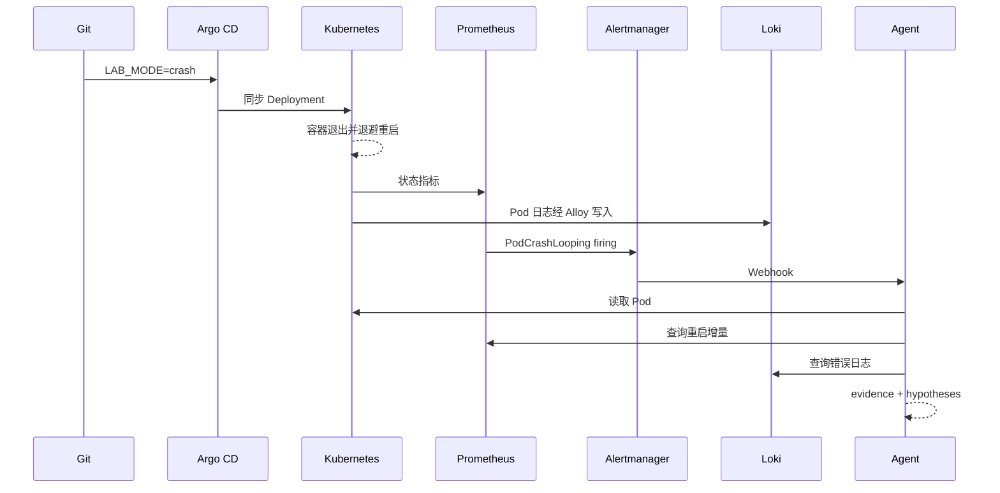

# 一个 Pod 崩溃后发生了什么

上一篇搭建了基础平台。这一篇只做一件事：

> 让一个 Pod 因启动配置缺失持续退出，并沿着系统留下的证据找到原因。

实验使用真实运行结果。文中的输出只做长度裁剪和动态名称替换，不伪造状态。

## 1. 先预测，再运行

工作负载默认以 `LAB_MODE=healthy` 运行。实验通过 Git 将其改为 `crash`，
启动时输出：

```text
fatal: required config /config/app.yaml not found
```

随后以非零状态退出。运行实验前先预测：

1. Deployment 资源会被 Argo CD 正常同步；
2. Pod 会被 kubelet 反复重启并进入 `CrashLoopBackOff`；
3. kube-state-metrics 暴露等待原因和重启计数；
4. PrometheusRule 持续满足 30 秒后生成 `PodCrashLooping`；
5. Alertmanager 等待分组后将 firing 同时发送给 Webhook 和 Agent；
6. Alloy 把退出前的错误写入 Loki；
7. Agent 查询 Kubernetes、Prometheus 和 Loki，输出事实与推断分离的报告；
8. Git 中把模式改为 `healthy` 后，工作负载先恢复，告警随后才 resolved。



## 2. 实验配置与安全边界

可执行资源位于
[`gitops/demo/crashloop`](https://github.com/buleye-ai/ai-lab/tree/main/gitops/demo/crashloop)：

- 独立 `demo` Namespace；
- 故障 Deployment；
- 只把现有只读 ClusterRole 绑定到 `demo`；
- 容器不挂载 ServiceAccount token、只读根文件系统、删除 Linux capabilities。

告警规则：

```promql
max by (namespace, pod, container) (
  max_over_time(
    kube_pod_container_status_waiting_reason{
      namespace="demo",
      reason="CrashLoopBackOff"
    }[5m]
  )
) == 1
```

这里使用五分钟窗口，而不是只看查询瞬间。CrashLoop 容器会在“正在运行并退出”
和“等待下一次重启”之间切换；只查询当前等待状态会产生空档，让 `for: 30s`
反复归零。窗口函数表达的是“最近确实观察过 CrashLoopBackOff”。

这不是预先假设：第一次真实运行使用瞬时条件时，Prometheus 已经观测到重启增量，
自定义告警却因状态闪烁无法稳定满足 `for`。改用窗口后，告警才按预测进入
pending 和 firing。

Agent 的边界不因实验放宽：

- namespace 必须在 allowlist；
- Kubernetes 仅允许读取 pods、events、deployments 和 replicasets；
- 无权读取 Secret；
- 无权 create、patch、update 或 delete；
- Prometheus/Loki 查询有时间窗、结果数和超时限制；
- `automatic_action_taken` 固定为 `false`。

## 3. 启动实验

根 Application 会创建默认健康的 `crashloop-demo` 子 Application：

```bash
kubectl get application crashloop-demo -n argocd
kubectl get deployment,pod,rolebinding -n demo
```

在 `gitops/demo/crashloop/workload.yaml` 中将：

```yaml
- name: LAB_MODE
  value: healthy
```

改为：

```yaml
- name: LAB_MODE
  value: crash
```

通过 Git 启用故障：

```bash
git add gitops/demo/crashloop/workload.yaml
git commit -m "test: trigger crashloop demo"
git push
```

等待 Pod 进入退避状态：

```bash
kubectl get pod -n demo -w
```

记录动态 Pod 名：

```bash
POD=$(kubectl get pod -n demo \
  -l app.kubernetes.io/name=crashloop-demo \
  -o jsonpath='{.items[0].metadata.name}')
```

## 4. 沿时间线收集证据

以下证据采集于 2026-07-28 的本地 k3d 实验。Pod、trace 和 fingerprint 等
动态标识在保存的公开样本中使用占位符脱敏。

### T0：Git 与 Argo CD

```bash
kubectl get application crashloop-demo -n argocd
kubectl get deployment crashloop-demo -n demo
```

观察重点：Application 可以是 `Synced`，但 Deployment/Pod 健康异常。配置一致和应用健康是两个维度。

真实结果：

```text
NAME             SYNC     HEALTH        REVISION
crashloop-demo   Synced   Progressing   253e09e...
```

### T1：Kubernetes 状态与事件

```bash
kubectl get pod "$POD" -n demo
kubectl describe pod "$POD" -n demo
kubectl logs "$POD" -n demo --previous
```

Kubernetes 证据回答“对象现在处于什么状态、容器为什么退出”，但不会自动证明根因。

真实快照：

```text
READY   STATUS             RESTARTS
0/1     CrashLoopBackOff   5

restartCount=5 state=CrashLoopBackOff
fatal: required config /config/app.yaml not found
```

### T2：Prometheus 数值证据

```promql
sum by (namespace, pod, container) (
  increase(kube_pod_container_status_restarts_total{
    namespace="demo",
    pod="<pod>"
  }[10m])
)
```

指标回答“最近十分钟发生了多少次重启”，适合判断趋势和触发告警。

同一时刻的真实查询值约为 `4.26`。`increase()` 会根据采样点外推，所以结果可以
是小数；它表达时间窗口内的估算增量，不是 Pod 状态中的整数累计值。

### T3：Alertmanager 事件

```bash
kubectl logs deployment/alert-webhook \
  -n observability --since=10m
```

firing payload 应包含 `alertname`、`namespace`、`pod` 和 `container`，否则
Agent 不会猜测目标。

本次自定义告警在 `14:56:49Z` 进入 pending，约 30 秒后 firing，
Alertmanager 再等待 5 秒分组，于 `14:57:24Z` 完成首次通知。经过脱敏的完整
payload 见
[`pod-crashlooping-firing.json`](/cloud-native-foundation/evidence/pod-crashlooping-firing.json)。

### T4：Loki 上下文证据

```logql
{namespace="demo", pod="<pod>"} |~ "(?i)error|fatal|not found|failed"
```

日志回答“进程退出前说了什么”。它比指标提供更多上下文，但一行错误仍不等于已证明根因。

Agent 的 Loki 查询实际返回 6 条匹配日志，样例均为：

```text
fatal: required config /config/app.yaml not found
```

### T5：DiagnosticReport

```bash
kubectl logs deployment/diagnostic-agent \
  -n ai-system --since=10m
```

报告必须分开：

- `evidence`：工具实际返回的状态、指标和日志；
- `hypotheses`：依据证据形成、仍可被反驳的原因判断；
- `tool_calls`：查询轨迹、状态和耗时；
- `safety`：只读与未执行自动动作的声明。

本次三次工具查询均成功：

| 工具 | 耗时 | 事实 |
| --- | ---: | --- |
| Kubernetes | 83 ms | restartCount=5 |
| Prometheus | 19 ms | 十分钟重启增量约 4.38 |
| Loki | 19 ms | 发现 6 条匹配日志 |

Agent 据此生成“可能引用不存在的文件、配置或依赖”的假设，置信度为 `0.82`。
这是合理推断，不是新事实。经过脱敏的完整报告见
[`diagnostic-report-firing.json`](/cloud-native-foundation/evidence/diagnostic-report-firing.json)。

## 5. 权限负向验证

使用 Agent 的身份确认允许与拒绝项：

```bash
kubectl auth can-i get pods \
  -n demo \
  --as system:serviceaccount:ai-system:diagnostic-agent

kubectl auth can-i get secrets \
  -n demo \
  --as system:serviceaccount:ai-system:diagnostic-agent

kubectl auth can-i patch deployments \
  -n demo \
  --as system:serviceaccount:ai-system:diagnostic-agent
```

预期依次为 `yes`、`no`、`no`。能查询 Prometheus/Loki，不代表它拥有 Kubernetes 写权限。

## 6. 通过 Git 恢复

在 `gitops/demo/crashloop/workload.yaml` 中修改：

```yaml
- name: LAB_MODE
  value: healthy
```

提交并推送，不使用 `kubectl edit`：

```bash
git add gitops/demo/crashloop/workload.yaml
git commit -m "fix: recover crashloop demo"
git push
```

观察两个不同时间点：

```bash
kubectl rollout status deployment/crashloop-demo -n demo
kubectl get alerts -n observability
kubectl logs deployment/alert-webhook -n observability --since=10m
```

新 Pod Ready 表示工作负载恢复；Prometheus 下一次评估发现表达式为空、Alertmanager
完成状态处理并发送 resolved，表示告警生命周期结束。两者不会发生在同一瞬间。

真实时间线：

| 事件 | UTC 时间 |
| --- | --- |
| PodCrashLooping 开始满足 `for` | 14:56:49 |
| 告警 firing | 14:57:19 |
| Alertmanager/Agent 收到 firing | 14:57:24 |
| 恢复后的新 Pod Ready | 14:59:19 |
| 五分钟窗口过期，告警结束 | 15:04:19 |
| Alertmanager/Agent 收到 resolved | 15:04:24 |

因此应用恢复到 resolved 通知相差约五分钟零五秒，这是规则窗口和通知分组共同
决定的预期延迟。resolved payload 与 Agent 关闭报告分别见
[`pod-crashlooping-resolved.json`](/cloud-native-foundation/evidence/pod-crashlooping-resolved.json)
和
[`diagnostic-report-resolved.json`](/cloud-native-foundation/evidence/diagnostic-report-resolved.json)。
resolved 报告的 `tool_calls` 为空：它只关闭事件，不重复执行完整诊断。

实验结束后保持默认 `healthy`；需要重复时，再通过一次 Git 提交改为
`crash`。也可以从根 Application 移除 demo 子 Application，并由 prune 清理。

## 7. 诚实复盘

这次实验能够证明：

- GitOps 可以同步一个配置正确但运行失败的 Deployment；
- Kubernetes、指标、事件和日志从不同角度描述同一故障；
- 告警可以成为 Agent 的结构化触发入口；
- 只读 Agent 能组合证据，不需要集群写权限；
- 恢复工作负载与 resolved 通知存在可观察的时间差。

它不能证明：

- 单节点本地存储具备生产可靠性；
- 这条规则在真实业务中具有理想的噪声水平；
- 当前确定性诊断适用于所有 CrashLoop 根因；
- Agent 已经比人工或固定 Runbook 更准确。

因此下一阶段不是开放自动修复，而是建立评测集：相同告警输入、固定证据快照、
期望事实、允许的假设和禁止的动作。先量化 Agent 是否提升诊断质量，再讨论执行权。

## 8. 实验验收清单

- [x] Argo CD 创建并同步 crashloop-demo
- [x] Pod 真实进入 CrashLoopBackOff
- [x] Prometheus 查询返回重启增量
- [x] Alertmanager 发送 firing
- [x] Loki 返回同一 Pod 的错误日志
- [x] Agent 输出只读 DiagnosticReport
- [x] Secret 读取和 Deployment patch 均被拒绝
- [x] Git 恢复后 Pod Ready
- [x] Alertmanager 发送 resolved

回到第一篇：
**[从零搭建 k3s、GitOps 与可观测性基础平台](/cloud-native-foundation/)**
