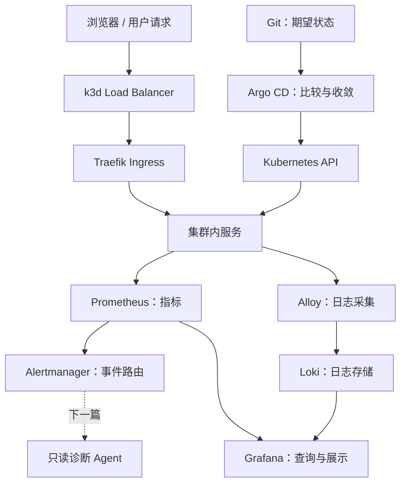

# 从零搭建 k3s、GitOps 与可观测性基础平台

很多云原生教程以“一排绿色 Pod”结束，但真正重要的是能够回答：

> 请求、配置、指标、告警和日志如何在系统中流动，某一层失败时又该去哪里找证据？

这一篇完成基础平台的搭建和逐层验收。下一篇将制造一次真实
CrashLoop，观察故障如何穿过 Kubernetes、Prometheus、Alertmanager、Loki 和
只读诊断 Agent。

## 最终架构



| 层次 | 组件 | 解决的问题 |
| --- | --- | --- |
| Kubernetes | k3d + k3s | 在本机运行真实 Kubernetes 控制循环 |
| 流量入口 | Traefik | 将外部请求路由到 ClusterIP Service |
| 配置交付 | Argo CD | 让集群持续收敛到 Git 的期望状态 |
| 指标 | Prometheus + Grafana | 采集、查询和展示时间序列 |
| 告警 | PrometheusRule + Alertmanager | 将持续异常转成可路由事件 |
| 日志 | Alloy + Loki | 采集并按标签查询 Pod 日志 |

## 1. 前置条件与仓库

本文环境是 macOS + OrbStack/Docker，要求：

- Docker API 可用；
- `k3d`、`kubectl`、`helm` 已安装；
- GitHub 能访问 ai-lab 公共仓库；
- 本机 `8080` 和 `8443` 端口未被占用。

```bash
docker version
k3d version
kubectl version --client
helm version
git clone https://github.com/buleye-ai/ai-lab.git
cd ai-lab
```

关键目录：

```text
ai-lab/
├── gitops/
│   ├── bootstrap/              # 根 Application
│   ├── applications/           # 子 Application
│   ├── observability/          # 监控、告警和日志 values/manifests
│   ├── agent/                  # 诊断 Agent 工作负载
│   └── demo/                   # 可重复故障实验
└── agent/diagnostic-agent/     # Harness、契约与测试
```

仓库保存可执行配置；本文解释每层为何存在、如何运行和怎样证明它有效。

## 2. 创建 Kubernetes 基座

### 解决什么问题

k3s 的节点组件是 Linux 进程，不能直接作为原生 macOS 进程运行。这里实际有三层：

```text
macOS
└── OrbStack / Docker：提供 Linux 容器环境
    └── k3d：创建容器化节点、网络、端口映射和 kubeconfig
        └── k3s：真正执行 Kubernetes API、调度器和控制器
```

k3d 不是另一种 Kubernetes，它是本地 k3s 集群的生命周期管理器。

### 创建集群

```bash
k3d cluster create ai-lab \
  --image rancher/k3s:v1.35.5-k3s1 \
  --servers 1 \
  --agents 2 \
  --port "8080:80@loadbalancer" \
  --port "8443:443@loadbalancer" \
  --wait
```

### 检查点 1：控制面能观察到节点

```bash
kubectl config current-context
kubectl get nodes -o wide
kubectl get pods -A
kubectl get storageclass
kubectl get ingressclass
```

预期：

- context 是 `k3d-ai-lab`；
- 一个 server、两个 agent 全部 `Ready`；
- 存在默认 `local-path` StorageClass；
- 存在 `traefik` IngressClass。

如果节点不是 Ready，先检查容器和 k3s 日志，而不是继续安装上层组件：

```bash
k3d cluster list
docker ps --filter name=k3d-ai-lab
docker logs k3d-ai-lab-server-0
```

生产环境需要高可用控制面、etcd 备份和故障域设计；本实验保留控制循环，不模拟高可用。

## 3. 理解统一入口

访问 Grafana 时，请求路径是：

```text
http://grafana.localhost:8080
→ Mac 8080
→ k3d server load balancer 80
→ Traefik
→ Host 匹配 Ingress
→ Grafana ClusterIP Service
→ Grafana Pod
```

本环境只有 Traefik 使用 `LoadBalancer`。Argo CD、Grafana 和 Alertmanager
都保持 `ClusterIP`，避免 k3s ServiceLB 为多个服务申请相同的节点
`80/443 hostPort`。

### 检查点 2：入口端口存在

```bash
docker port k3d-ai-lab-serverlb
kubectl get service traefik -n kube-system
kubectl get pods -n kube-system | grep svclb
```

预期 Mac `8080/8443` 分别映射到负载均衡器的 `80/443`，Traefik 和
`svclb-traefik-*` Pod 正常。

若 `svclb-*` Pod Pending，使用 `kubectl describe pod` 检查是否为 hostPort
冲突。

## 4. 安装 Argo CD

### 解决什么问题

手工 `kubectl apply` 或 `helm upgrade` 只能执行一次变更，不能持续确认 Git
和集群是否一致。Argo CD 持续运行：

```text
读取 Git 期望状态
→ 渲染 Helm / Kustomize / YAML
→ 读取 Kubernetes 实际状态
→ 比较 Diff
→ 同步、自愈或清理
→ 再次观察
```

这和 Kubernetes Controller 使用同一种
`observe → compare → act → observe` 模型。

### 安装管理面

```bash
helm repo add argo https://argoproj.github.io/argo-helm
helm repo update

helm upgrade --install argocd \
  argo/argo-cd \
  --version 10.2.1 \
  --namespace argocd \
  --create-namespace \
  --set server.service.type=ClusterIP \
  --set-string 'configs.params.server\.insecure=true' \
  --set server.ingress.enabled=true \
  --set server.ingress.ingressClassName=traefik \
  --set server.ingress.hostname=argocd.localhost \
  --wait \
  --timeout 10m
```

`argocd-server` 提供 UI/API，`repo-server` 计算期望资源，
`application-controller` 才是比较并收敛状态的核心循环。UI 暂时不可访问，
不等于后台同步一定停止。

### Bootstrap App of Apps

根 Application 位于
[`gitops/bootstrap/root-application.yaml`](https://github.com/buleye-ai/ai-lab/blob/main/gitops/bootstrap/root-application.yaml)：

```bash
kubectl apply -f gitops/bootstrap/root-application.yaml
kubectl get applications -n argocd
```

根 Application 会创建 monitoring、loki、alloy、alerting、
diagnostic-agent 等子 Application。以后变更遵循：

```text
修改 → 本地渲染校验 → commit / PR → push
→ Argo CD 比较 desired/live state → 同步 → 健康检查
```

不要再长期使用手工 Helm 修改已经交给 Argo CD 的资源，否则会制造 Git 外配置漂移。

### 检查点 3：配置与运行状态分开看

```bash
kubectl get applications -n argocd
kubectl get pods -n argocd
curl -I http://argocd.localhost:8080
```

- `Synced`：Git 渲染结果与集群资源是否一致；
- `Healthy`：资源是否达到了 Argo CD 能识别的运行条件。

Deployment 可以 Synced，但其 Pod 因镜像拉取失败而不 Healthy。

## 5. 部署指标、告警和日志

### 指标链路

```text
node-exporter / kube-state-metrics / 应用指标
→ ServiceMonitor 发现抓取目标
→ Prometheus 定时 pull
→ PromQL 查询
→ Grafana 展示
```

关键配置在
[`kube-prometheus-stack-values.yaml`](https://github.com/buleye-ai/ai-lab/blob/main/gitops/observability/kube-prometheus-stack-values.yaml)。
本地 Prometheus 保存 7 天指标并使用 `local-path` PVC。

Grafana 负责查询和展示；真实指标仍保存在 Prometheus。

### 告警链路

```text
PrometheusRule 持续计算
→ 条件满足 for 时间
→ firing alert
→ Alertmanager 去重、分组、抑制和路由
→ Webhook / 诊断 Agent
```

关键规则在
[`prometheus-rule.yaml`](https://github.com/buleye-ai/ai-lab/blob/main/gitops/observability/alerting/prometheus-rule.yaml)。
`for` 要求异常持续存在，避免瞬时抖动直接通知。Alertmanager 不判断 CPU
是否过高，它处理已经生成的事件。

### 日志链路

```text
容器 stdout / stderr
→ Kubernetes Pod logs
→ Alloy 发现并采集
→ Loki 存储日志和标签索引
→ LogQL 查询
→ Grafana 展示
```

关键配置在
[`alloy-values.yaml`](https://github.com/buleye-ai/ai-lab/blob/main/gitops/observability/alloy-values.yaml)。

namespace、app、pod 和 container 适合作为标签；请求 ID、用户 ID 等高基数字段
应留在正文中按需过滤。

### 检查点 4：逐层证明可观测性有效

```bash
kubectl get pods,pvc,ingress -n observability
kubectl get prometheus,prometheusrule -n observability
kubectl get applications -n argocd

curl -I http://grafana.localhost:8080
curl -I http://alertmanager.localhost:8080
```

在 Prometheus UI 的 **Status → Target health** 中确认主要 targets 为 Up；在
Grafana Explore 执行：

```promql
up
```

再选择 Loki 数据源执行：

```logql
{namespace="observability"}
```

测试 Webhook：

1. 临时通过 Git 将 `AiLabAlertPipelineTest` 表达式改为 `vector(1)`；
2. 等待 Argo CD 同步、规则的 `for` 和 Alertmanager `group_wait`；
3. 查看接收器日志；
4. 将表达式恢复为 `vector(0) == 1`，确认出现 resolved。

```bash
kubectl logs deployment/alert-webhook -n observability --tail=100
```

如果没有通知，按 `PrometheusRule → Prometheus Alerts → Alertmanager Alerts
→ receiver logs` 的顺序定位，不要直接猜测网络问题。

## 6. 本地实验和生产环境的边界

| 本地实验 | 生产通常需要 |
| --- | --- |
| 单 server k3s | 高可用控制面、备份恢复 |
| `local-path` PVC | 可靠存储、快照和故障域 |
| 单体单副本 Loki | 对象存储、按规模拆分、多副本 |
| 单 Prometheus | HA、远端写入、长期保留 |
| HTTP `.localhost` | DNS、TLS、证书轮换、网关策略 |
| 初始管理员 | SSO、最小权限 RBAC、审计 |
| 默认 AppProject | 仓库、目标和资源类型白名单 |
| 测试 Webhook | 值班路由、升级策略、告警治理 |

实验室的价值不是复制所有生产复杂度，而是让关键机制可以被观察、破坏、诊断和恢复。

## 7. 第一篇验收

完成后，应能独立解释：

1. k3d、k3s 和容器运行时分别负责什么；
2. HTTP 请求如何从 Mac 到 Pod；
3. Git、Argo CD 和 Kubernetes 分别保存什么状态；
4. `Synced` 与 `Healthy` 为什么不是一回事；
5. Prometheus、Grafana 和 Alertmanager 如何分工；
6. Pod 日志如何进入 Loki；
7. 本地方案和生产设计有哪些明确差距。

下一篇不再增加组件，而是制造一个 Pod 启动配置缺失的故障，用真实证据检验这套心智模型：

**[一个 Pod 崩溃后发生了什么：CrashLoop 端到端诊断实战](/cloud-native-foundation/crashloop-incident)**
