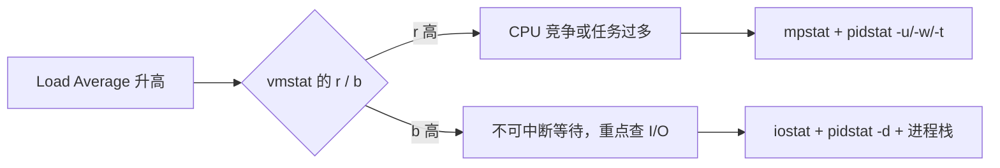

# CPU 性能心智模型

## 1. 两个观测视角

| 视角 | 指标 | 回答的问题 |
|---|---|---|
| 业务 | QPS、吞吐、错误率、P50/P95/P99 延迟、队列长度 | 用户是否受到影响 |
| 系统 | CPU 时间分类、负载、运行队列、上下文切换、中断 | 瓶颈为什么发生 |

CPU 100% 不必然是故障。批处理和计算任务可能就是为了跑满 CPU。真正需要处理的是：业务 SLO 受损、吞吐无法随资源增加、排队持续增长或 CPU 时间消耗在非业务工作上。

## 2. CPU 时间分类

| 指标 | 含义 | 高值时优先怀疑 |
|---|---|---|
| `us/user` | 用户态代码 | 算法、循环、序列化、JIT、业务热点 |
| `sy/system` | 内核态代码 | 系统调用、上下文切换、内核路径 |
| `wa/iowait` | CPU 空闲且存在未完成 I/O | 块设备、文件系统、存储链路 |
| `hi` | 硬中断 | 设备、中断亲和性、硬件异常 |
| `si/soft` | 软中断 | 网络收发、小包、调度、RCU |
| `st/steal` | 被宿主机拿走的 CPU | 云主机争抢、宿主机超售 |
| `id/idle` | 空闲 | 不能单独证明系统健康 |

注意：

- `pidstat %wait` 是任务等待 CPU 的时间，不是 I/O 等待。
- `top wa` 是 CPU 的 I/O 等待时间。二者不能比较。
- `iowait` 不是设备利用率，也不能单独证明磁盘是根因。

## 3. 平均负载不是 CPU 使用率

平均负载是平均活跃任务数，包含：

- 正在运行或等待 CPU 的 `R` 状态任务；
- 等待不可中断资源的 `D` 状态任务。



三个时间窗口用于判断趋势：

- 1 分钟 > 5 分钟 > 15 分钟：负载正在上升；
- 1 分钟 < 5 分钟 < 15 分钟：负载正在恢复；
- 三者长期超过逻辑 CPU 数：持续过载，但仍需区分 `R` 和 `D`。

## 4. 上下文切换

`vmstat` 提供系统总量：

- `cs`：每秒上下文切换；
- `in`：每秒中断；
- `r`：运行和等待 CPU 的任务；
- `b`：不可中断任务。

`pidstat -w` 提供任务维度：

- `cswch/s`：自愿切换，通常在等待 I/O、锁、条件变量或其他资源；
- `nvcswch/s`：非自愿切换，通常因 CPU 争抢、时间片或抢占。

必须下钻线程：

```bash
pidstat -w -t 1
```

评论区和案例都证明，只观察进程主线程可能只看到几百次切换，而真正的问题隐藏在子线程中，系统总切换可以达到百万级。

上下文切换没有跨机器通用的绝对阈值。关注：

- 相对自身基线是否发生数量级增长；
- `r` 是否超过 CPU 数；
- `sy` 是否明显升高；
- 切换增长时吞吐是否反而下降。

## 5. 进程状态

| 状态 | 含义 | 操作重点 |
|---|---|---|
| `R` | 运行或等待 CPU | 查任务数、线程数、非自愿切换 |
| `S` | 可中断睡眠 | 通常正常，结合等待点判断 |
| `D` | 不可中断睡眠 | 查块 I/O、文件系统、设备、内核栈 |
| `Z` | 已退出但父进程未回收 | 查父进程 `wait/waitpid/SIGCHLD` |
| `I` | 空闲内核线程 | 不计入平均负载 |
| `T/t` | 暂停或被跟踪 | 查信号、调试器 |

`D` 状态不是“占着 CPU 不放”，而是不能被普通信号中断。短暂出现正常；长期或大量出现才说明等待的内核资源没有及时返回。

`Z` 状态不会继续执行，但会占用 PID 和进程表项。大量僵尸最终可能使系统无法创建新进程。

## 6. 中断

硬中断负责快速完成时间敏感的上半部；软中断异步完成下半部。每个 CPU 通常有 `ksoftirqd/N`。

生产中最常见的是网络接收软中断：

```text
si 升高
→ /proc/softirqs 中 NET_RX 增长快
→ sar 显示 PPS 高但 BPS 不高
→ 平均包很小
→ tcpdump 确认包型、端口和来源
```

软中断不一定由“内核自己”造成。应用发送同样数据量时，32 字节小包和 1 KB 批量发送对 PPS、软中断和系统调用的压力完全不同。

