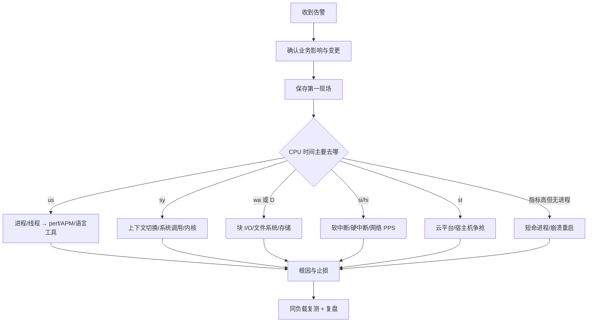

# CPU 故障处置 SOP

## 0. 触发条件

进入本 SOP 的典型信号：

- CPU 告警持续超过约定窗口；
- P95/P99 延迟或错误率同步恶化；
- Load、运行队列或上下文切换显著偏离基线；
- 单核被打满、`si/sy/wa/st` 异常；
- 系统响应变慢但找不到明显高 CPU 进程。

## 1. 故障流程



## 2. 第一阶段：5 分钟内确认与止损

### 2.1 记录事件上下文

```text
开始时间：
告警来源：
影响服务/实例：
QPS、错误率、P95/P99：
最近发布、配置、流量和依赖变化：
同集群其他实例是否正常：
```

优先看同配置实例和历史基线，避免把常态误判为事故。

### 2.2 保存低开销现场

```bash
date
uptime
top -b -H -n 1
vmstat 1 5
mpstat -P ALL 1 5
pidstat -u -w -t 1 5
ps -eLo state,pid,ppid,tid,psr,pri,ni,pcpu,wchan:32,comm --sort=-pcpu
cat /proc/softirqs
cat /proc/interrupts
```

将输出和业务指标放在同一个时间轴中。不要只复制一张 `top` 截图。

### 2.3 止损选择

按风险从低到高：

1. 限流、降级、暂停非核心批任务；
2. 切走流量或摘除异常实例；
3. 回滚最近变更；
4. 扩容；
5. 对确定的异常进程做优雅重启；
6. 最后才考虑强杀或主机重启。

如果系统已因 I/O 或网络拥塞导致 SSH 无法操作，现场命令可能无法执行。此时应以预先配置的监控、旁路采集和云平台控制面为准，优先恢复服务。

## 3. 第二阶段：按 CPU 类型分流

### A. `us` 高：用户态热点

```bash
pidstat -u -t 1
top -H -p <PID>
perf top -p <PID>
perf record -F 99 -g -p <PID> -- sleep 15
perf report
```

检查：

- 算法复杂度和无效循环；
- 正则、序列化、压缩、加密；
- GC/JIT；
- 业务热点、重试风暴；
- 外部命令被频繁调用。

### B. `sy` 高：内核态或调度

```bash
vmstat 1
pidstat -w -t 1
strace -c -p <PID>    # 仅在确认风险后短时使用
perf record -F 99 -g -a -- sleep 15
```

判断：

- `nvcswch/s` 高、`r` 高：CPU 争抢、线程池过大；
- `cswch/s` 高：锁、I/O、条件变量或轮询；
- 系统调用占比高：小批量 I/O、日志、短连接、频繁 fork/exec；
- `RES` 快速增长：多核重调度，但单核机器不会出现该现象。

### C. `wa` 或 `D` 状态多：I/O 等待

```bash
iostat -xz 1
pidstat -d 1
ps -eo state,pid,ppid,wchan:32,comm | awk '$1 ~ /D/'
cat /proc/<PID>/stack
perf record -F 49 -g -p <PID> -- sleep 10
```

确认：

- 哪个块设备；
- 顺序/随机、读/写；
- direct I/O 还是缓存 I/O；
- 本地盘、云盘、NFS 或分布式存储；
- cgroup IOPS 限制；
- 设备是否实际繁忙。

不要因为 `iowait` 高就直接断言“磁盘坏了”。评论案例中，cgroup 限速会制造高等待，但宿主机 `iostat` 可能仍显示设备空闲。

### D. `si/hi` 高：中断

```bash
watch -d cat /proc/softirqs
watch -d cat /proc/interrupts
sar -n DEV 1
ethtool -S <NIC>
tcpdump -i <NIC> -nn -c 200
```

若 `NET_RX` 增长快：

1. 比较 PPS 与 BPS；
2. 计算平均包大小；
3. 抓包确认 SYN、UDP、重传、来源和目的端口；
4. 联合交换机、防火墙或负载均衡止损；
5. 再评估 RSS/RPS/XPS、irqbalance、合包和应用发送批次。

SSH 卡顿可能只是网络丢包和延迟，并不要求 CPU 已经打满。评论中的 SYN Flood 案例里，`si` 只有几个百分点，但 SSH 延迟已从不足 1 ms 增至约 245 ms并出现丢包。

### E. `st` 高：虚拟化争抢

- 与同宿主机或同规格实例对比；
- 查看云厂商宿主机指标；
- 迁移、升配或联系云平台；
- 不要把 steal 当作应用代码问题。

### F. 整机 CPU 高，但找不到高 CPU 进程

优先怀疑：

- 短命进程；
- 应用崩溃后被 supervisor/systemd/Kubernetes 重启；
- 每个请求执行外部命令；
- 采样周期过长。

```bash
pstree -ap
execsnoop
perf record -F 99 -g -a -- sleep 15
perf report
```

案例中的 PHP 每次请求都 `exec(stress)`；命令因临时文件权限失败而高速退出，PID 不断变化，`top` 和 `pidstat` 很难捕捉。`execsnoop` 能直接显示 PID、PPID、命令参数和返回值。

## 4. 第三阶段：根因、修复与验证

根因描述必须包含：

```text
触发条件 + 故障机制 + 证据 + 业务影响
```

示例：

> 发布后的 PHP 路径在每次请求中执行外部 `stress`。容器用户没有临时文件写权限，子进程初始化失败并高速重启，造成大量短命进程和用户/系统 CPU 消耗。`execsnoop`、`pstree`、错误输出和 `perf` 调用链共同确认。

验证至少包含：

- 相同请求模型；
- 相同机器和依赖；
- 优化前后 QPS、P95/P99、错误率；
- 优化前后 CPU 分类、Load、`r`、`cs`；
- 持续一段稳定窗口；
- 无功能回归。

## 5. 升级与终止条件

立即升级给内核、平台或云厂商团队：

- 持续 D 状态且等待点位于驱动或文件系统；
- `st` 异常；
- 单设备、单中断或单核行为无法由应用解释；
- 内核栈卡死、hung task、soft lockup；
- 需要修改内核参数、中断亲和性或生产 `perf_event` 权限。

停止深入采样并先恢复服务：

- 延迟/错误率仍快速恶化；
- 采样工具明显增加负载；
- 系统即将失去远程控制；
- 已有足够证据支持可逆的止损措施。

