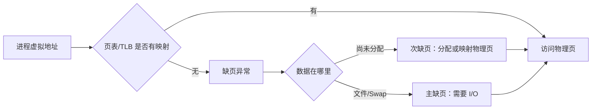
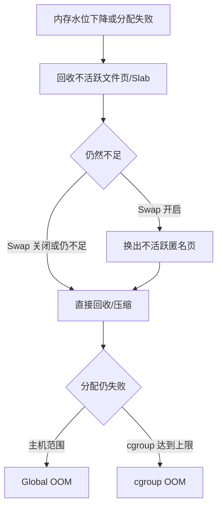

# Linux 内存性能心智模型

## 1. 从虚拟地址到物理内存

进程看到连续、独立的虚拟地址空间。内核通过页表把虚拟页映射到物理页，TLB 缓存常用映射。普通页常见为 4 KiB，大页常见为 2 MiB 或 1 GiB。



`malloc()` 成功不代表物理内存已经分配。首次写入时才可能真正触发缺页和物理页分配。因此：

- VIRT 可以很大，但 RSS 很小；
- 只申请、不触碰的内存不会等量消耗物理内存；
- 内存压测必须实际写页。

## 2. 进程地址空间

| 区域 | 典型内容 | 生命周期 |
|---|---|---|
| 代码/只读段 | 指令、常量 | 随进程 |
| 数据段 | 全局、静态变量 | 随进程 |
| 堆 | `malloc/calloc/new` | 应用负责释放 |
| 文件映射区 | 动态库、文件映射、共享内存 | 应用与内核共同管理 |
| 栈 | 局部变量、调用上下文 | 作用域或线程退出自动回收 |

小块分配通常由用户态分配器从堆中复用，大块分配常借助 `mmap`。释放后 RSS 不立即下降不一定是泄漏：分配器可能保留 arena 供后续复用，或发生碎片化。

内核小对象由 Slab/SLUB 管理；用户态 `malloc` 不是直接使用 Slab。

## 3. free、available 与缓存

```bash
free -h
```

| 指标 | 含义 |
|---|---|
| `free` | 完全未使用的物理内存 |
| `available` | 在不引发明显交换的情况下，预计可供新应用使用的内存 |
| `buff/cache` | Buffer、页缓存和部分可回收 Slab |
| `shared` | 主要包含 tmpfs 等共享内存 |

Linux 会利用空闲内存做缓存，因此 `free` 很低通常是正常现象。评论区有用户为了让 `free` 变大而写程序“挤掉缓存”，这只会破坏性能，不能增加真实容量。

## 4. Buffer、Page Cache 与 Slab

- Buffer：与块设备数据相关的缓存；
- Page Cache：普通文件读写的页缓存；
- `SReclaimable`：可回收 Slab；
- `SUnreclaim`：当前不能回收的 Slab。

现代 Linux 已统一了许多早期重复缓存路径。实务上应关注具体内核和工具定义，不死背“Buffer 只写、Cache 只读”：

- 普通文件读写都会利用 Page Cache；
- 裸块设备 I/O 与 Buffer 相关；
- Direct I/O 通常绕过页缓存；
- 裸 I/O 是跳过文件系统，两者不是同一个概念。

## 5. VIRT、RSS、PSS、USS

| 指标 | 含义 | 陷阱 |
|---|---|---|
| VIRT/VSZ | 虚拟地址空间 | 包含未驻留、共享、映射和已换出内存 |
| RSS | 常驻物理页 | 共享页会在多个进程中重复计算 |
| PSS | 私有页 + 按共享者比例分摊的共享页 | 适合估算进程真实物理内存贡献 |
| USS | 进程独占物理页 | 进程退出后一定可释放的近似值 |

统计全部进程物理内存时应累计 PSS，而不是 RSS：

```bash
grep Pss /proc/[1-9]*/smaps 2>/dev/null |
  awk '{total+=$2} END {printf "%.1f MiB\n", total/1024}'
```

优先使用更轻量的：

```bash
cat /proc/<PID>/smaps_rollup
```

## 6. 缺页

- minor fault：不需要磁盘 I/O，例如首次分配、共享页映射；
- major fault：需要磁盘 I/O，例如从文件或 Swap 读入。

主缺页持续升高会显著增加尾延迟。容器冷启动、模型加载、大型二进制启动和 Swap 抖动都可能体现为 major faults。

## 7. 回收、Swap 和 OOM



`vm.swappiness` 是匿名页与文件页回收的相对倾向，不是“内存使用百分比”。设置为 0 也不等价于彻底禁用 Swap；要禁用需不启用或 `swapoff` 并修改持久配置。

Swap 已用量不会因为物理内存后来空闲就自动归零。真正要观察：

- `si/so` 是否持续；
- `pgmajfault` 是否增长；
- 受影响进程是谁；
- 业务延迟是否同步恶化。

OOM 不是简单的“某进程 VIRT + used > 物理内存”。实际行为还受 overcommit、内存水位、回收结果、NUMA、cgroup 限制、内核版本和分配上下文影响。诊断必须以 OOM 日志和对应 cgroup 事件为准。

现代系统使用 `/proc/<PID>/oom_score_adj`，范围通常为 `-1000..1000`。不要把课程旧环境中的 `oom_adj` 数值直接用于新系统。

## 8. NUMA

整机还有 available，不代表当前 NUMA Node 有足够本地内存。检查：

```bash
numactl --hardware
numastat
cat /proc/sys/vm/zone_reclaim_mode
```

NUMA 失衡可能表现为：

- 某 Node 内存紧张；
- 跨 Node 访问增多；
- 系统总空闲内存不少却发生回收或 Swap；
- 单节点应用延迟异常。

