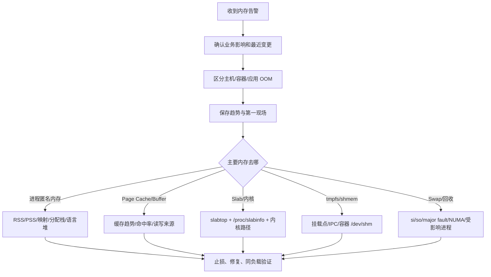

# 内存故障处置 SOP

## 0. 常见触发信号

- `available` 持续下降；
- memory PSI、主缺页、直接回收持续升高；
- Swap in/out、磁盘 I/O 与延迟同步上升；
- 进程 RSS/PSS 单调增长；
- OOMKilled、主机 OOM 或分配失败；
- Page Cache、Slab、tmpfs 或页表异常增长；
- 容器达到 `memory.max`；
- 应用 GC 时间、分配率或堆外内存异常。

## 1. 故障流程



## 2. 5 分钟内：确认范围与保存现场

### 2.1 业务和事件

```text
开始时间：
影响服务/实例/容器：
错误率、P95/P99、QPS：
OOMKilled/重启次数：
发布、配置、流量和批任务变化：
同配置实例是否一致：
```

### 2.2 系统快照

```bash
date
free -h
vmstat 1 5
sar -r -S 1 5
cat /proc/meminfo
cat /proc/pressure/memory
grep -E 'pgmajfault|pgscan|pgsteal|pswpin|pswpout|oom' /proc/vmstat
ps -eo pid,ppid,rss,vsz,%mem,comm --sort=-rss | head -30
dmesg -T | grep -Ei 'out of memory|oom-kill|killed process'
```

### 2.3 容器快照

cgroup v2：

```bash
cat /sys/fs/cgroup/memory.current
cat /sys/fs/cgroup/memory.max
cat /sys/fs/cgroup/memory.high
cat /sys/fs/cgroup/memory.events
cat /sys/fs/cgroup/memory.stat
cat /sys/fs/cgroup/memory.pressure
```

Kubernetes：

```bash
kubectl describe pod <pod>
kubectl top pod <pod> --containers
kubectl get pod <pod> -o jsonpath='{.status.containerStatuses[*].lastState.terminated.reason}'
```

容器 OOM 只说明 cgroup 达到限制，不代表主机内存耗尽。

## 3. 止损策略

风险从低到高：

1. 停止非核心批处理、导入、备份和大查询；
2. 限流、降级、切走流量；
3. 回滚最近变更；
4. 水平扩容；
5. 对确定泄漏的单实例做滚动重启；
6. 调整容器 limit 前先确认节点余量；
7. 主机已失控时通过控制面摘流或重启。

禁止：

- 为了让 `free` 变大直接清空生产页缓存；
- 内存紧张时直接 `swapoff -a`；
- 没有证据就调高 `vm.min_free_kbytes`、overcommit 或 OOM 优先级；
- 只提高容器 limit 而不检查节点容量和泄漏。

## 4. 分类诊断

### A. available 低，但缓存很大

```bash
grep -E 'MemAvailable|Cached|Buffers|SReclaimable|SUnreclaim|Dirty|Writeback' /proc/meminfo
vmstat 1
sar -r 1
slabtop
```

判断：

- Page Cache 稳定且命中率高：可能是健康缓存；
- Cache 持续增长且业务无收益：查大文件扫描、备份、镜像拉取；
- `SUnreclaim` 持续增长：怀疑内核对象或驱动泄漏；
- Dirty/Writeback 高：关注写回和 I/O；
- PSI 高、回收高：即使 available 尚未归零也存在压力。

不要在生产上用 `drop_caches` 当修复。它会丢失热缓存，造成后续 I/O 尖峰。

### B. 某进程内存持续增长

```bash
pidstat -r -p <PID> 1
cat /proc/<PID>/smaps_rollup
pmap -x <PID>
grep -E 'VmRSS|VmSwap|RssAnon|RssFile|RssShmem|Threads' /proc/<PID>/status
```

继续区分：

- 语言堆：JVM heap dump/JFR、Go pprof、Python tracemalloc；
- native heap：memleak、heaptrack、Valgrind、jemalloc/tcmalloc profile；
- mmap：数据库、模型、共享内存、文件映射；
- 线程栈：线程数量异常；
- 分配器缓存/碎片：业务释放后 RSS 不回落；
- 泄漏：同负载下 PSS/RSS 长期单调增长且未进入平台期。

BCC `memleak` 需要匹配内核能力、uprobes 和符号。旧内核可选 Valgrind/SystemTap；生产不能随意升级内核时，要提前准备语言 profiler 和符号。

### C. OOM

先分类：

```text
应用自身 OutOfMemory
≠ 容器/cgroup OOM
≠ 主机 Global OOM
```

证据：

```bash
dmesg -T | grep -Ei 'out of memory|oom-kill|killed process'
cat /proc/<PID>/oom_score
cat /proc/<PID>/oom_score_adj
cat /sys/fs/cgroup/memory.events
```

检查：

- 被杀进程不一定是触发分配失败的进程；
- `oom_score_adj` 是否改变受害者选择；
- 是否在特定 NUMA Node 或 cgroup 内 OOM；
- 应用是否有堆外/native 内存；
- 容器 request/limit 是否与峰值和副本密度匹配；
- Redis fork、JVM GC、数据库排序等是否产生瞬时峰值。

### D. Swap 高或抖动

```bash
free -h
vmstat 1
sar -W 1
sar -r -S 1
grep -E 'pswpin|pswpout|pgmajfault' /proc/vmstat
smem --sort swap
```

没有 `smem` 时：

```bash
for f in /proc/[0-9]*/status; do
  awk '/^Name:/{n=$2}/^Pid:/{p=$2}/^VmSwap:/{s=$2}
       END{if(s>0) print s,p,n}' "$f"
done | sort -nr | head
```

解释：

- Swap Used 高但 `si/so` 为 0：历史换出页仍在 Swap，不一定正抖动；
- `si`、major faults、磁盘读与延迟同步升高：进程正在受影响；
- 大文件扫描可使 Page Cache 抢占内存，并把冷匿名页换出；
- 整机空闲但某 Node 回收：查 NUMA 与 `zone_reclaim_mode`。

### E. Page Cache 命中率或 Direct I/O

```bash
cachestat 1
cachetop 5
pcstat <file>
strace -f -e trace=openat,read,write -p <PID>
```

`cachetop` 不统计 Direct I/O。命中率显示 100% 也可能只覆盖少量元数据或普通 I/O；必须把 HITS×页大小换算为实际字节数，与应用吞吐对比。

不要默认删除 `O_DIRECT`。数据库常主动管理缓存，Direct I/O 可能是正确设计。优化必须看业务一致性、写放大和双重缓存。

### F. Slab 或内核内存

```bash
slabtop
grep -E 'Slab|SReclaimable|SUnreclaim|KernelStack|PageTables' /proc/meminfo
cat /proc/slabinfo
```

常见方向：

- dentry/inode：大量小文件、容器层；
- conntrack/socket：连接激增；
- PageTables：大量进程或巨大稀疏映射；
- KernelStack：线程数过多；
- 不可回收 Slab：内核模块、驱动或对象泄漏。

## 5. 根因与验证

根因表述应包含：

```text
触发条件 + 内存类型 + 增长/回收机制 + 证据 + 业务影响
```

示例：

> 新版本在异常返回路径遗漏 `free()`。同等流量下进程 PSS 每小时稳定增长，`memleak` 未释放分配栈集中在 `decode_request()`，最终容器达到 `memory.max`，`memory.events` 的 `oom_kill` 增加并触发重启。

修复后验证：

- 相同负载和数据规模；
- PSS/RSS 是否进入稳定平台；
- PSI、major faults、Swap in/out 是否恢复；
- GC/分配率和延迟是否改善；
- 容器没有继续 OOMKilled；
- 缓存命中率与 I/O 无退化。

