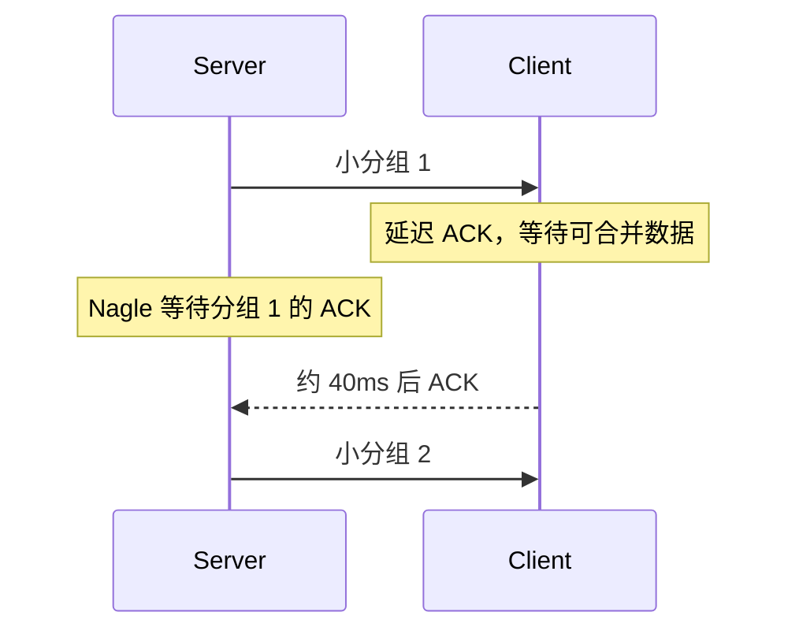

# 网络心智模型：一次请求到底经过了什么

## 1. 先把“网络慢”拆成时间段

一次 HTTPS 请求的总时间可以近似拆成：

```text
总时间 =
DNS +
TCP 建连 +
TLS 握手 +
请求排队/发送 +
服务端处理 +
首字节返回 +
响应传输
```

因此，`total=2s` 不是根因。先定位哪一段增长，再选择工具。


## 2. Linux 收包路径


任一队列来不及消费都会丢包：

| 位置 | 常见信号 | 常见原因 |
|---|---|---|
| NIC RX ring | `ethtool -S` 的 missed/drop | ring 太小、CPU 来不及收包 |
| softnet backlog | `/proc/net/softnet_stat` drop/time_squeeze | 单核软中断过载、PPS 太高 |
| 协议栈 | `nstat` IP/TCP 错误 | 校验、路由、重组、监听队列 |
| socket buffer | UDP receive errors、TCP 零窗口 | 应用消费慢、缓冲区不足 |
| 应用队列 | 延迟升高但系统未丢包 | 线程池、GC、锁、下游依赖 |

## 3. Linux 发包路径


发包慢可能是：

- 对端窗口小或为零；
- 拥塞窗口受限、重传与 RTO；
- qdisc 排队或整形；
- 邻居解析失败；
- 网卡/驱动发送错误；
- 应用一次次发送小包。

## 4. 四组不能混用的指标

### 吞吐量与 PPS

- BPS：每秒字节数，反映带宽压力。
- PPS：每秒包数，反映协议栈与 CPU 压力。
- 小包流量可能 BPS 很低但 PPS 极高，典型表现是 `softirq` 升高。

### 延迟与吞吐

吞吐最大时往往已经产生排队，延迟未必最好。压测必须同时观察 RPS、错误率和延迟分位数。

### 丢包与重传

- TCP 重传是可靠传输的结果，不等于本机网卡一定丢包。
- UDP 没有协议级重传，更依赖应用指标与双端抓包。
- 抓包看到 “TCP Retransmission” 也要结合序列号、SACK、乱序和抓包点校验。

### 连接数与请求数

HTTP Keep-Alive、HTTP/2 多路复用使连接数与请求数不再一一对应。不能仅凭 `ESTABLISHED` 数判断业务流量。

## 5. TCP 状态的生产含义

| 状态 | 大量出现时优先检查 |
|---|---|
| `SYN-SENT` | 对端不可达、ACL、防火墙、服务未监听、SYN/SYN-ACK 丢失 |
| `SYN-RECV` | SYN Flood、accept 队列、CPU/PPS 压力 |
| `ESTABLISHED` | 正常长连接，或应用未及时关闭/读取 |
| `CLOSE-WAIT` | 对端已关闭，本地应用没有 `close()` |
| `TIME-WAIT` | 主动关闭方的正常保护；短连接过多、连接池缺失 |
| `FIN-WAIT-2` | 对端未正常关闭，或应用/网络异常 |

不要为了清除 `TIME_WAIT` 随意修改内核参数。先确认连接角色、短连接比例、端口范围和连接复用。

## 6. Nagle 与延迟确认

课程案例中，服务端开启 Nagle，而客户端使用 Delayed ACK，形成约 40ms 的互相等待：



低延迟小消息服务可评估 `TCP_NODELAY`，但它可能增加 PPS。必须通过真实报文大小、延迟和 CPU 验证，而不是全局套用。

## 7. 容器与 Kubernetes 额外路径

典型 Pod 出站路径：

```text
进程 → Pod netns → veth → 节点路由/bridge
→ NetworkPolicy → kube-proxy/eBPF → SNAT/conntrack → NIC
```

要同时检查：

- Pod 内 DNS、路由和 MTU；
- 节点 veth、CNI 与 NetworkPolicy；
- Service 后端与 EndpointSlice；
- conntrack 表和 NAT；
- 节点到目标端的真实链路。

## 8. 现代环境的修正

- `netstat` 仍可读，但新系统优先使用 `ss`。
- 防火墙可能由 nftables、iptables-nft 或 eBPF 管理，不能只看一套规则。
- `tcp_tw_recycle` 已从新内核移除，不应写入现代调优手册。
- GRO/LRO/TSO/GSO 会改变抓包看到的包尺寸和分段形态；抓包结论要考虑 offload。
- ICMP 被限速或禁用时，使用 TCP/UDP 模式的 `traceroute`、`hping3` 或应用探测。

