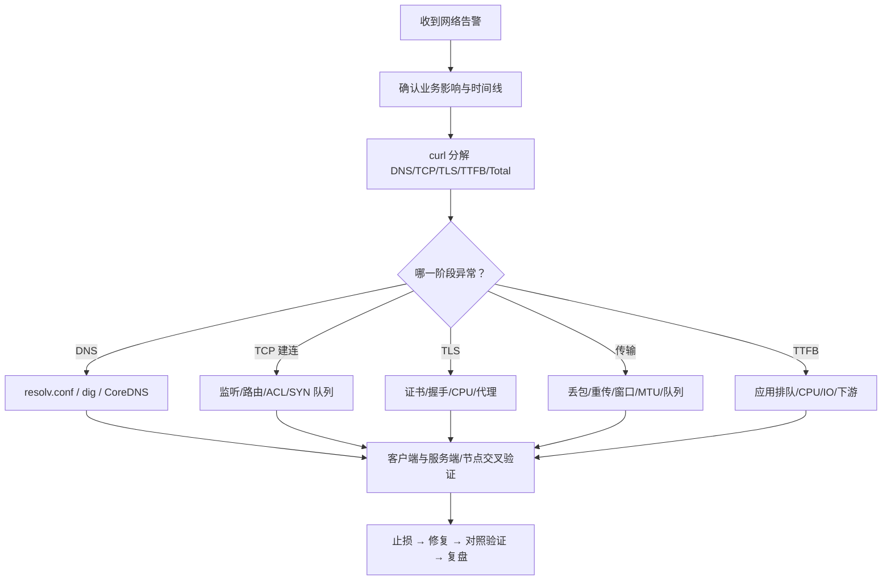

# 网络故障排查 SOP

## 0. 目标与纪律

目标不是证明“网络有问题”，而是回答：

1. 哪些用户、接口、区域和实例受影响？
2. 失败发生在 DNS、建连、TLS、传输还是应用处理？
3. 故障边界在客户端、服务端、容器节点还是中间链路？
4. 哪个指标和哪份数据能证明根因？

生产纪律：

- 先保存时间范围、源/目的、端口、协议和发布事件。
- 抓包需控制接口、主机、端口、文件大小和时长。
- 调 sysctl、MTU、防火墙、路由前保存旧值并准备回滚。
- 不在业务高峰进行无限时长抓包或无边界压测。

## 1. 总体流程



## 2. 第一阶段：5 分钟定界

### 2.1 记录范围

```text
开始时间：
受影响接口/域名：
源 IP/Pod/区域：
目的 IP/Pod/区域：
协议和端口：
失败比例与 p99：
最近发布、扩缩容、证书、DNS、CNI、网络策略变更：
```

### 2.2 做四组对照

- 域名访问 vs 固定 IP（注意 Host/SNI）。
- 故障实例 vs 正常实例。
- Pod 内 vs Node 上。
- 同区域 vs 跨区域。

### 2.3 分阶段计时

```bash
curl -sS -o /dev/null \
  -w 'code=%{http_code} remote=%{remote_ip} dns=%{time_namelookup} connect=%{time_connect} tls=%{time_appconnect} ttfb=%{time_starttransfer} total=%{time_total}\n' \
  https://example.com/
```

判断：

- `dns` 高：走 DNS 分支。
- `connect-dns` 高：走建连分支。
- `tls-connect` 高：走 TLS 分支。
- `ttfb-tls` 高：优先应用、代理或下游。
- `total-ttfb` 高：响应体传输、窗口、带宽或客户端读取。

## 3. 第二阶段：系统快照

```bash
date -Is
uptime
ip -br addr
ip route
ip -s link
ss -s
ss -tan
nstat -az
sar -n DEV,EDEV,TCP,ETCP 1 10
cat /proc/net/softnet_stat
tc -s qdisc show
```

同步检查 CPU：

```bash
mpstat -P ALL 1
pidstat -u -w 1
grep -E 'NET_RX|NET_TX' /proc/softirqs
cat /proc/interrupts
```

网络性能问题经常表现为单核 `softirq` 打满，而整机 CPU 平均值并不高。

## 4. 分支 A：DNS 慢或失败

```bash
cat /etc/resolv.conf
getent ahosts example.com
dig example.com
dig @<DNS_IP> example.com
dig +trace example.com
```

容器/Kubernetes：

```bash
kubectl exec <pod> -- cat /etc/resolv.conf
kubectl exec <pod> -- getent hosts <service>
kubectl -n kube-system get pods -l k8s-app=kube-dns -o wide
kubectl -n kube-system logs -l k8s-app=kube-dns --tail=200
kubectl get endpointslice -A
```

重点判断：

- `/etc/resolv.conf` 是否为空、错误或 search 域过多；
- 上游 DNS 是否高延迟、丢包或限流；
- `ndots` 是否让一个名字触发多次查询；
- CoreDNS 是否 CPU 饱和、缓存命中下降、上游超时；
- DNS UDP 响应过大后是否转 TCP，以及防火墙是否允许 TCP/53；
- 缓存是否尊重 TTL，避免陈旧地址长期存在。

止损可选：切换健康上游、启用本地/NodeLocal 缓存、降低无意义查询、临时固定解析。固定 IP 只能是短期措施，并要评估负载均衡和证书影响。

## 5. 分支 B：TCP 建连失败

服务端确认：

```bash
ss -lntp
ss -ant state syn-recv
ss -ant state syn-sent
nstat -az | grep -Ei 'Listen|Syn|Retrans'
```

网络路径：

```bash
ip route get <DEST_IP>
ip neigh show
traceroute --tcp -p <PORT> -n <DEST_IP>
hping3 -S -p <PORT> -c 5 <DEST_IP>
```

逐层检查：

1. 进程是否监听正确地址和端口；
2. 本地路由、策略路由、邻居表是否正常；
3. 主机防火墙、安全组、NetworkPolicy；
4. LB/Ingress 后端是否健康；
5. backlog 是否溢出；
6. SYN、SYN-ACK 或 ACK 在哪一段丢失。

## 6. 分支 C：延迟高、抖动或重传

```bash
ss -ti dst <DEST_IP>
nstat -az | grep -Ei 'Retrans|Timeout|Lost|Sack|ZeroWindow'
mtr -n -r -w -c 100 <DEST_IP>
tc -s qdisc show dev eth0
ethtool -S eth0
```

观察 `ss -ti` 的 RTT、RTO、cwnd、retrans、pacing rate 和窗口信息。

双端抓包：

```bash
timeout 60 tcpdump -i any -nn -s 128 \
  'host <PEER_IP> and port <PORT>' \
  -C 100 -W 3 -w /tmp/net-incident.pcap
```

抓包判断：

- 请求是否真正离开客户端；
- 服务端是否收到；
- 服务端何时响应；
- 同一序列号在哪边首次重复；
- 是否有 ICMP fragmentation needed；
- 是否出现零窗口、Dup ACK、SACK 或 RST。

## 7. 分支 D：丢包

按路径从上到下统计：

```bash
ip -s link show dev eth0
ethtool -S eth0
cat /proc/net/softnet_stat
nstat -az
netstat -su
tc -s qdisc show dev eth0
```

判定提示：

- 网卡计数增长：驱动、ring、物理链路或对端交换设备；
- softnet drop 增长：CPU/NAPI/backlog；
- UDP `RcvbufErrors`：应用消费慢或 socket buffer 小；
- qdisc drop：出口整形或排队；
- 仅应用超时但系统无丢包：应用队列、连接池和下游。

## 8. 分支 E：NAT/conntrack

```bash
conntrack -S
sysctl net.netfilter.nf_conntrack_count
sysctl net.netfilter.nf_conntrack_max
ss -s
cat /proc/sys/net/ipv4/ip_local_port_range
```

典型问题：

- conntrack 表接近上限，新连接随机失败；
- 大量短连接导致 SNAT 临时端口耗尽；
- NAT 网关单目标五元组容量不足；
- 规则过多或顺序不合理增加每包处理成本；
- 会话超时不匹配业务长连接。

优先通过连接池、长连接、扩展源 IP/端口空间、分散 NAT 网关解决；扩大表项只是容量措施，还会增加内存成本。

## 9. 分支 F：DDoS 或异常 PPS

信号组合：

- PPS 突增但 BPS 不高；
- `softirq`、softnet drop 上升；
- `SYN_RECV` 激增；
- 源地址、端口或报文尺寸分布异常；
- 正常请求建连超时。

止损优先级：

1. CDN/WAF/运营商或云清洗；
2. 上游 ACL、限速与黑洞策略；
3. 主机尽早 `DROP` 恶意流量；
4. SYN cookies、队列容量等主机缓解；
5. XDP/eBPF 在协议栈更前方丢弃。

`REJECT` 会主动回复，攻击下仍消耗出口与 CPU；明确不需响应时，`DROP` 通常成本更低。

## 10. Kubernetes 专项

```bash
kubectl get pod -o wide
kubectl get svc,endpoints,endpointslice
kubectl describe networkpolicy -A
kubectl exec <pod> -- ip addr
kubectl exec <pod> -- ip route
kubectl exec <pod> -- ss -s
```

对照顺序：

```text
Pod → 同节点 Pod → 跨节点 Pod → ClusterIP → 后端 PodIP
→ NodeIP → 外部目标
```

这能快速区分应用、Service 转发、CNI 跨节点和出口 NAT。

## 11. 修复验证与复盘

至少验证：

- 错误率、p95/p99 和超时恢复；
- TCP 重传、丢包、softnet drop 不再增长；
- backlog/conntrack/端口使用有余量；
- 修复在正常流量和峰值流量下均成立；
- 回滚路径有效。

复盘必须记录“第一条异常指标”“最终证据”“无效尝试及原因”，避免下次继续靠猜。

