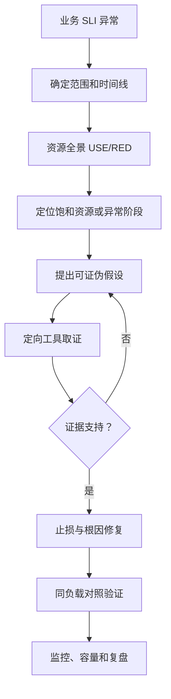
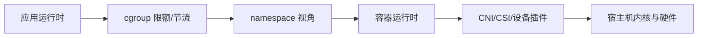

# 系统化性能分析方法

## 1. 性能问题的本质

性能问题通常是以下一种或多种：

- 资源饱和：CPU、内存、磁盘、网络、连接、线程或队列达到容量；
- 排队放大：利用率接近上限后，等待时间非线性增长；
- 错误与重试：超时触发重试，重试进一步放大负载；
- 资源竞争：锁、调度、NUMA、共享下游或 noisy neighbor；
- 配置不匹配：容器限额、JVM、backlog、MTU、连接池；
- 工作负载变化：流量、数据量、请求结构、热点键或恶意流量；
- 代码退化：算法复杂度、分配、系统调用、序列化或日志。

## 2. 统一证据链



### USE 与 RED

资源视角 USE：

- Utilization：利用率；
- Saturation：排队和等待；
- Errors：错误、丢弃和失败。

服务视角 RED：

- Rate：请求量；
- Errors：错误率；
- Duration：延迟分布。

两个视角必须关联。CPU 100% 但业务正常不一定是事故；CPU 30% 但被 cgroup throttle 可能已经严重变慢。

## 3. 五步排障法

### 第一步：量化现象

不要从“服务器卡”开始，而要记录：

```text
哪个接口/任务？
哪批用户/实例？
开始与恢复时间？
RPS、错误率、p95/p99 怎么变化？
最近有哪些发布、配置、扩缩容和流量变化？
```

### 第二步：建立正常基线

任何单个数值都需要对照：

- 同一服务正常实例；
- 昨日/上周同一时段；
- 发布前后；
- 单请求与并发；
- 宿主机与容器；
- 客户端与服务端。

### 第三步：先粗后细

推荐层级：

```text
业务指标
→ 主机/容器资源
→ 进程/线程
→ 系统调用/协议状态
→ 调用栈/内核函数
→ 源码与配置
```

不要一上来就抓全量包或运行 `perf record`；如果 DNS 阶段已经占了 10 秒，先解决 DNS。

### 第四步：区分相关性和因果

调参后“看起来快了”并不能证明根因。需要：

1. 参数对应的机制能解释现象；
2. 修改前有指标证明它受限；
3. 修改后该指标恢复；
4. 同样负载下业务 SLI 改善；
5. 没把瓶颈转移成新的错误。

### 第五步：闭环

修复后把临时知识转成：

- 仪表盘；
- 组合告警；
- 容量阈值；
- 发布检查；
- 自动证据包；
- 故障演练；
- SOP 与面试案例。

## 4. 性能优化的正确顺序

1. 让结果正确：先消除 5xx、超时和丢包。
2. 消除明确上限：cgroup、conntrack、backlog、端口、线程池。
3. 优化最宽热点：算法、锁、系统调用、网络路径。
4. 减少工作量：缓存、批处理、连接复用、避免复制。
5. 提升并行性：前提是没有引入更多竞争。
6. 扩容：知道单实例瓶颈后再横向扩展。

课程吞吐案例提醒：RPS 从 189 升到 5382，但大量响应仍失败，这不是成功优化。有效吞吐应按成功请求计算：

```text
有效吞吐 = 成功请求数 / 时间
```

## 5. 容器性能的额外维度



容器不是轻量虚拟机。排障必须回答：

- 应用看到的 CPU/内存是否与 cgroup 一致？
- 是资源使用高，还是 quota 导致的等待高？
- OOM 是进程、cgroup 还是主机触发？
- 问题发生在 Pod 内、Node 上还是插件路径？

## 6. 现代环境修正

- 现代 JVM 已普遍支持容器感知，但仍要确认版本和 `MaxRAMPercentage` 等配置。
- JVM 堆上限不能等于容器内存限制；还要给 metaspace、线程栈、直接内存、code cache 和 native 库留余量。
- cgroup v2 优先检查 `cpu.stat`、`memory.events`、`memory.current`、`memory.max`。
- eBPF 很强，但内核、BTF、权限、符号和探针开销仍会限制使用。
- 工具输出受内核版本、namespace、offload 与采样频率影响，不能脱离环境解释。

