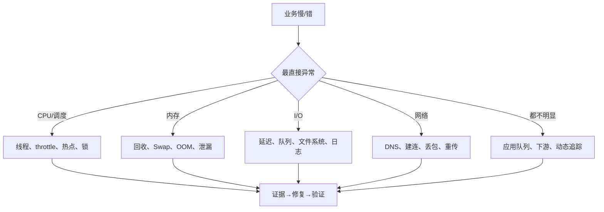

# 综合性能事故 SOP

## 0. 事故前提

先保证安全：

- 指定事件负责人、记录人和变更执行人；
- 所有命令带时间戳，标明在主机、容器还是客户端执行；
- 高开销工具限制 PID、事件、时长和输出空间；
- 一次变更一个主要变量，准备回滚；
- 不在事故中运行无上限压测。

## 1. 0–5 分钟：确认影响并止血

记录：

```text
开始时间：
业务 SLI：
受影响用户/区域/接口/任务：
故障实例与正常实例：
最近变更：
是否持续扩大：
```

可逆止损：

- 回滚最近发布；
- 摘除异常实例；
- 限流、熔断、关闭非核心功能；
- 扩容或切流；
- 暂停重试风暴和批处理任务。

止损不能破坏现场。重启前尽可能保存指标、日志、容器状态和内核事件。

## 2. 5–10 分钟：资源全景

```bash
date -Is
uptime
vmstat 1
mpstat -P ALL 1
pidstat -u -r -d -w 1
free -h
iostat -xz 1
sar -n DEV,TCP,ETCP 1
ss -s
```

容器/Kubernetes：

```bash
kubectl top pod
kubectl describe pod <pod>
kubectl get pod <pod> -o wide
cat /sys/fs/cgroup/cpu.stat
cat /sys/fs/cgroup/memory.events
```

## 3. 快速分流



### CPU/调度

- 总 CPU 不高但进程慢：检查 cgroup throttle、单核、锁和等待；
- `us` 高：应用热点；
- `sy/si` 高：系统调用、网络协议栈、驱动；
- `wa` 高：进一步看 I/O 延迟，不把它简单等同于磁盘故障。

### 内存

- 看 `available`、PSI、回收和 OOM，不只看 `free`；
- 区分主机 OOM 与 cgroup OOM；
- Swap 存量与持续 `si/so` 分开；
- JVM/Go/数据库还要结合运行时指标。

### I/O

- 看 `await`、队列、吞吐和利用率组合；
- 找产生 I/O 的进程与文件；
- 区分磁盘、文件系统、同步写、日志和内存回收；
- 容器还要看 overlayfs、CSI 和底层存储。

### 网络

- 用 `curl` 分 DNS、connect、TLS、TTFB；
- 看丢包、重传、监听队列、conntrack 和端口；
- 必要时双端定向抓包；
- 容器按 Pod→Node→Service→后端→外部路径对照。

## 4. 10–30 分钟：定向取证

### 进程与线程

```bash
ps -eLo pid,tid,psr,stat,pcpu,pmem,wchan:24,comm --sort=-pcpu
pidstat -t -p <PID> 1
top -H -p <PID>
```

### 调用栈

```bash
perf top -p <PID>
perf record -F 49 -g -p <PID> -- sleep 30
perf report
```

Java/Go/Python 优先使用语言运行时工具或正确的符号映射，再与系统级工具交叉验证。

### 系统调用

```bash
strace -f -ttT -c -p <PID>
```

只短时使用；高频系统调用进程上 `strace` 可能显著改变性能。

### 动态追踪

选择原则：

| 目标 | 优先工具 |
|---|---|
| CPU 热点 | perf + 火焰图 |
| 调度延迟 | perf sched、eBPF 调度工具 |
| 块 I/O 延迟 | iostat + biolatency/biosnoop |
| TCP 重传 | nstat/ss + tcpretrans |
| 文件访问 | opensnoop/filetop |
| 旧内核 | ftrace/SystemTap/perf |

## 5. 修复验证

必须使用与修改前相同的：

- 请求模型与并发；
- 数据集；
- 测试时长；
- 客户端；
- 指标口径。

同时验证：

```text
成功吞吐
错误率
p95/p99
CPU/内存/I/O/网络副作用
新瓶颈
持续稳定性
```

## 6. 复盘模板

```text
事故摘要：
业务影响：
发现方式：
时间线：
第一条异常指标：
错误假设及排除证据：
决定性证据：
临时止损：
根因修复：
验证结果：
为什么监控没有更早发现：
长期行动项（负责人/截止时间）：
```

