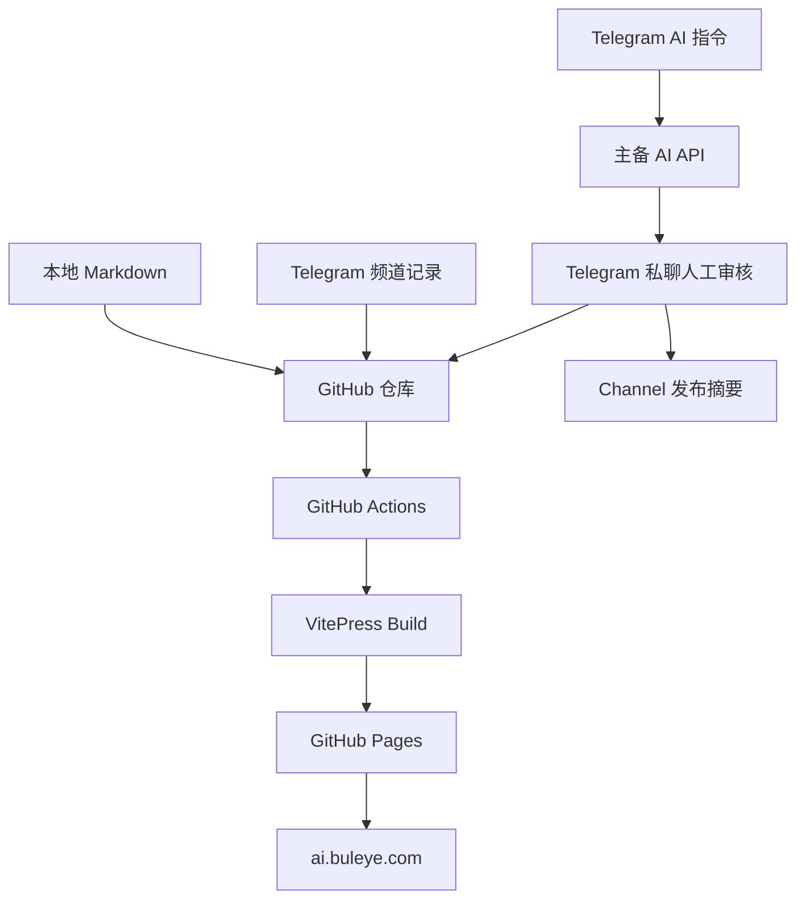

# 从零搭建 GitHub Pages、Telegram 与 AI 联动的个人技术博客

这篇教程复盘本站从空仓库到正式上线的完整工程过程。它只讨论建站、
自动化发布、域名、Telegram 和 AI 流水线，不讨论如何抓取课程或编写
具体技术文章。

最终得到的不是一个只能手工上传 Markdown 的静态站，而是一套个人内容
平台：



AI 生成内容不会直接公开。所有内容先进入 Telegram 私聊审核，再根据按钮
决定是否进入博客和公开 Channel。

- 从零完成 VitePress、GitHub Actions、GitHub Pages 和自定义域名上线；
- 接入 Telegram 移动端输入、私聊审核、Channel 摘要与博客全文发布；
- 用幂等、主备降级和补偿任务解决并发、回调过期与跨系统部分失败。

## 1. 为什么选择这套架构

### 1.1 解决的问题

个人知识站通常卡在四件事上：

1. 写完内容还要手动部署，发布成本高；
2. 灵感出现在手机上，回到电脑后已经忘记；
3. AI 能生成内容，但直接自动发布风险太高；
4. API、机器人和域名配置散落，出现故障时不知道从哪一层排查。

这套架构将 GitHub 当作内容数据库和审计日志，将 GitHub Actions 当作
无服务器任务调度器，将 Telegram 当作移动端输入和人工审批界面，将
GitHub Pages 当作托管平台。

### 1.2 主要取舍

| 方案 | 优点 | 代价 |
| --- | --- | --- |
| VitePress | Markdown 原生、构建快、适合技术文档 | 动态能力需要自己补 |
| GitHub Pages | 免费、HTTPS、与仓库和 Actions 集成 | 只适合静态站 |
| GitHub Actions | 无需维护服务器，可调度任务 | Cron 不保证准点 |
| Telegram Bot | 手机输入、按钮审批、Channel 发布 | 轮询回调存在时效问题 |
| 人工审核 | 避免幻觉和错误公开 | 多一步确认 |
| 主备 AI API | 限流或余额异常时自动降级 | 需要统一接口与错误处理 |

对个人知识站而言，这些取舍比自建一台长期运行的服务器更轻，也更容易
通过 Git 历史复现。

## 2. 准备工作

需要准备：

- GitHub 账号；
- Node.js 22；
- pnpm；
- GitHub CLI；
- 一个可管理 DNS 的域名；
- Telegram 账号、公开 Channel 和 Bot；
- 至少一个 OpenAI 兼容的 API。

检查本地环境：

```bash
node --version
pnpm --version
git --version
gh --version
gh auth status
```

`gh auth status` 应显示已经登录目标 GitHub 账号。不要把终端中的 Token
复制到聊天、截图或仓库。

## 3. 创建 GitHub 仓库

可以先在 GitHub 创建一个空仓库，也可以使用 CLI：

```bash
mkdir cloud-native-aiops-performance-lab
cd cloud-native-aiops-performance-lab

git init
git branch -M main
gh repo create cloud-native-aiops-performance-lab \
  --public \
  --source=. \
  --remote=origin
```

本站仓库为：

```text
buleye-ai/cloud-native-aiops-performance-lab
```

建议使用公开仓库作为作品集。如果内容包含公司内部信息、生产日志或商业
数据，应改用私有仓库并确认 GitHub Pages 权限与套餐。

## 4. 初始化 VitePress

安装 VitePress：

```bash
pnpm init
pnpm add -D vitepress
```

`package.json` 中保留最小脚本：

```json
{
  "private": true,
  "type": "module",
  "scripts": {
    "docs:dev": "vitepress dev docs",
    "docs:build": "vitepress build docs",
    "docs:preview": "vitepress preview docs"
  },
  "devDependencies": {
    "vitepress": "^1.6.4"
  }
}
```

建立目录：

```text
docs/
├── .vitepress/
│   └── config.mts
├── public/
├── index.md
├── thoughts/
│   └── index.md
└── learning/
    └── index.md
```

最小配置：

```ts
import { defineConfig } from "vitepress";

export default defineConfig({
  lang: "zh-CN",
  title: "Cloud Native AIOps Performance Lab",
  description: "Linux 性能、云原生、可观测性与 AIOps 实战知识库",
  base: "/",
  cleanUrls: true,
  lastUpdated: true,
  themeConfig: {
    nav: [
      { text: "首页", link: "/" },
      { text: "思考日志", link: "/thoughts/" },
      { text: "行业与英语", link: "/learning/" }
    ],
    search: { provider: "local" }
  }
});
```

本地验证：

```bash
pnpm docs:dev
```

发布前必须执行生产构建：

```bash
pnpm docs:build
pnpm docs:preview
```

开发服务器正常不代表生产构建一定正常。导航中的错误路径、Frontmatter
语法和服务端渲染问题，往往只有 `docs:build` 才能发现。

## 5. 使用 GitHub Actions 自动部署

创建 `.github/workflows/pages.yml`：

```yaml
name: Deploy GitHub Pages

on:
  push:
    branches: [main]
  workflow_dispatch:

permissions:
  contents: read
  pages: write
  id-token: write

concurrency:
  group: pages
  cancel-in-progress: true

jobs:
  build:
    runs-on: ubuntu-latest
    steps:
      - uses: actions/checkout@v4
      - uses: pnpm/action-setup@v4
        with:
          version: 11.9.0
      - uses: actions/setup-node@v4
        with:
          node-version: 22
          cache: pnpm
      - run: pnpm install --frozen-lockfile
      - run: pnpm docs:build
      - uses: actions/configure-pages@v5
        with:
          enablement: true
      - uses: actions/upload-pages-artifact@v3
        with:
          path: docs/.vitepress/dist

  deploy:
    environment:
      name: github-pages
      url: ${{ steps.deployment.outputs.page_url }}
    needs: build
    runs-on: ubuntu-latest
    steps:
      - id: deployment
        uses: actions/deploy-pages@v4
```

这里有三个关键点：

1. `pages: write` 和 `id-token: write` 是 Pages 部署权限；
2. 上传目录必须是 VitePress 的构建产物 `docs/.vitepress/dist`；
3. `pnpm install --frozen-lockfile` 保证 CI 使用的依赖与仓库锁文件一致。

提交并推送：

```bash
git add .
git commit -m "feat: bootstrap VitePress site"
git push -u origin main
```

在 GitHub 仓库的 `Actions` 页面检查 `Deploy GitHub Pages`。第一版默认
地址通常是：

```text
https://<account>.github.io/<repository>/
```

本站最初使用：

```text
https://buleye-ai.github.io/cloud-native-aiops-performance-lab/
```

## 6. 配置自定义域名

目标域名是：

```text
ai.buleye.com
```

### 6.1 在 DNS 控制台添加记录

在阿里云 DNS 中添加：

| 字段 | 值 |
| --- | --- |
| 记录类型 | `CNAME` |
| 主机记录 | `ai` |
| 记录值 | `buleye-ai.github.io` |
| TTL | 默认 |

子域名使用 CNAME，不需要把记录值写成完整仓库路径。

### 6.2 在仓库保存 CNAME

创建：

```text
docs/public/CNAME
```

文件内容只有一行：

```text
ai.buleye.com
```

VitePress 构建时会把它复制到站点根目录。没有这个文件时，后续部署可能
覆盖 GitHub Pages 中的自定义域名状态。

### 6.3 GitHub Pages 设置

进入：

```text
Repository
→ Settings
→ Pages
→ Custom domain
```

填写 `ai.buleye.com`，等待 DNS Check 通过，再开启 `Enforce HTTPS`。

验证：

```bash
dig ai.buleye.com CNAME
curl -I https://ai.buleye.com
```

域名刚修改时，DNS 和 HTTPS 证书都可能需要时间生效。浏览器空白并不
必然是代码问题，先用 `curl`、DNS 查询和 Actions 构建结果区分网络层、
证书层和应用层。

## 7. 创建 Telegram Channel 与 Bot

### 7.1 创建 Bot

在 Telegram 中打开 `@BotFather`：

```text
/newbot
```

按提示设置名称和用户名，保存得到的 Bot Token。Token 相当于密码，不要
写入仓库。

### 7.2 将 Bot 设置为 Channel 管理员

打开 Channel：

```text
Channel Info
→ Administrators
→ Add Admin
→ 选择机器人
```

至少开启：

- Post Messages；
- Edit Messages（如果要更新机器人消息）；
- Delete Messages 可选。

本站公开 Channel 为：

```text
@FrogsAndDucks
```

然后用个人账号打开机器人并发送：

```text
/start
```

机器人不能主动私聊一个从未与它建立会话的用户。

### 7.3 获取个人用户 ID 和 Channel ID

`TELEGRAM_ADMIN_USER_ID` 必须是个人数字 ID，不是用户名，也不是
Channel 的 `-100...` ID。可以通过 `@userinfobot` 查询。

Channel 可以使用公开用户名：

```text
@FrogsAndDucks
```

或者使用数字 Channel ID。

## 8. 配置 GitHub Actions Secrets

进入：

```text
Repository
→ Settings
→ Secrets and variables
→ Actions
→ New repository secret
```

Telegram Secrets：

| 名称 | 内容 |
| --- | --- |
| `TELEGRAM_BOT_TOKEN` | BotFather 生成的 Token |
| `TELEGRAM_ADMIN_USER_ID` | 管理员个人数字 ID |
| `TELEGRAM_CHAT_ID` | `@FrogsAndDucks` 或 Channel 数字 ID |

主备 AI Secrets：

| 名称 | 示例 |
| --- | --- |
| `AI_PRIMARY_API_KEY` | TeamoRouter Key |
| `AI_PRIMARY_BASE_URL` | `https://api.teamorouter.com/v1` |
| `AI_PRIMARY_MODEL` | `gpt-5.6-terra` |
| `AI_BACKUP_API_KEY` | V-API Key |
| `AI_BACKUP_BASE_URL` | `https://api.gpt.ge/v1` |
| `AI_BACKUP_MODEL` | 控制台实际提供的模型名 |

可选的官方 OpenAI 兜底：

```text
OPENAI_API_KEY
OPENAI_BASE_URL
OPENAI_MODEL
```

Secrets 页面只能看到名称和更新时间，不能重新读取值。这正是正确的安全
边界。API Key 不应出现在日志、Markdown、截图和 Git 历史中。

## 9. 设计 Telegram 内容入口

本站定义两类入口。

### 9.1 直接记录

```text
#思考 内容
#面试 内容
```

这两类内容本来就已经发布在公开 Channel，因此同步任务只负责生成
Markdown，不再重复向 Channel 发送。

### 9.2 AI 生成

```text
#总结 URL或材料
#写作 主题或材料
#复盘 事故记录
#见解 观点或问题
#帮助
```

AI 指令的控制流：

```text
Channel Post
→ 根据 update_id 读取新消息
→ 根据 message_id 去重
→ 调用主 AI API
→ 失败时切换备用 API
→ 生成 publication/pending/<id>.json
→ 私聊管理员发送审核按钮
→ 批准后生成 Markdown
→ Channel 发布摘要
→ GitHub Pages 部署全文
```

`publication/telegram-state.json` 保存 Telegram `offset`，避免重复消费；
候选文件使用 Channel `message_id` 作为幂等键，例如：

```text
publication/pending/tg-12.json
```

## 10. 兼容不同 AI API

中转站通常宣称兼容 OpenAI，但“兼容”可能指不同协议：

- OpenAI Responses API：`POST /v1/responses`；
- Chat Completions API：`POST /v1/chat/completions`。

本站的 `automation/ai-client.mjs` 采用：

```text
主线路 Responses
→ 端点不支持时尝试 Chat Completions
→ 主线路失败
→ 备用线路
→ OpenAI 兜底
→ 全部失败则停止发布
```

不能在所有错误上都盲目切换协议。例如余额不足、认证失败和请求限流不代表
端点不存在。只有 `404`、`405`、`501` 或明确的“Responses 不支持”
错误才适合尝试 Chat Completions。

生成结果要求严格 JSON，并在写入博客前校验：

- 标题；
- 英文摘要；
- 中文正文；
- 生产价值；
- 三个技术词汇；
- 面试表达。

这相当于在概率模型与确定性发布系统之间增加一道契约。

## 11. 实现人工审核

AI 候选通过 Telegram Inline Keyboard 发送：

```text
✅ 博客 + Channel
❌ 忽略
```

回调数据只保存短 ID：

```text
approve:tg-12
reject:tg-12
```

处理审批时必须再次验证：

```js
String(callback.from?.id) === String(adminUserId)
```

不能因为按钮只发到私聊，就省略鉴权。消息可能被转发，未来也可能增加更多
管理员。

批准后的状态：

```json
{
  "status": "approved",
  "blog_path": "docs/learning/...md",
  "channel_message_id": 14,
  "channel_url": "https://t.me/FrogsAndDucks/14"
}
```

博客保存全文，Channel 发布适合手机阅读的摘要和全文链接。机器人发出的
摘要不要再包含 `#见解` 等触发词，否则会形成自触发循环。

## 12. GitHub Actions 轮询与部署

`.github/workflows/telegram-sync.yml` 每五分钟尝试运行：

```yaml
on:
  schedule:
    - cron: "*/5 * * * *"
  workflow_dispatch:
```

任务需要：

```yaml
permissions:
  contents: write
  pages: write
  id-token: write
```

因为它不仅读取 Telegram，还会：

1. 创建或更新 Markdown 和状态文件；
2. 提交并推送到 `main`；
3. 构建 VitePress；
4. 部署 GitHub Pages。

GitHub 通过 `GITHUB_TOKEN` 产生的提交不一定再次触发其他工作流，因此同步
工作流内部直接完成 Pages 构建和部署，避免依赖第二次触发。

使用并发锁防止多个生成任务同时改写状态：

```yaml
concurrency:
  group: telegram-content
  cancel-in-progress: false
```

写入前执行：

```bash
git pull --rebase origin main
git push
```

这是为了处理定时任务、本地提交和其他工作流同时更新 `main` 时的
non-fast-forward 冲突。

### 12.1 让本地新文章通知 Channel

通过 Telegram AI 流程批准的文章会直接发布 Channel；本地或 Codex 编写
的 Markdown 则使用 Frontmatter 显式声明：

```yaml
telegram_publish: true
telegram_version: 1
```

Pages 部署成功后，`automation/notify-new-articles.mjs` 扫描这些标记，
发布文章摘要和公网链接，并把结果写入：

```text
publication/article-notifications.json
```

普通修改不会重复通知。如果文章重大更新需要再次推送，只需增加版本：

```yaml
telegram_version: 2
```

通知状态提交通过 `paths-ignore` 排除，不会形成“状态提交再次触发通知”的
无限循环。这里刻意要求显式标记，避免配置文件、导航调整或每次小修订都
打扰 Channel 订阅者。

## 13. 让用户随时知道有哪些功能

一个只有作者记得触发词的机器人不算可用系统。本站提供三个入口：

1. 机器人私聊 `/help` 或 `/features`；
2. Channel 中发送 `#帮助`；
3. 博客的 [Telegram 学习助手使用指南](/telegram-guide)。

Bot 菜单通过：

```text
setMyCommands
setChatMenuButton
```

进行配置。命令应设置在默认语言范围。如果只配置 `language_code=zh`，
客户端语言为 `zh-hans`、英文或其他值时，菜单可能不可见。

## 14. 将发布设计成可补偿任务

最初的审批流程是一个同步事务：

```text
生成 Markdown → 回应 Telegram 按钮 → 提交 Git
```

这存在问题：Telegram 的 `answerCallbackQuery` 有时效，按钮点下后如果
轮询太晚，会返回：

```text
query is too old and response timeout expired
```

如果把“按钮提示成功”当成关键步骤，整条工作流会退出，已经生成的内容也
不会提交。

改进后的原则：

1. 内容状态是事实来源；
2. 按钮提示只是用户体验，不应阻断发布；
3. `query is too old` 记录警告后继续；
4. 已批准但没有 `channel_message_id` 的候选视为待补发；
5. 后续同步自动重试 Channel 发布。

这就是一个轻量 Outbox/补偿事务：

```text
approved + blog_path + no channel_message_id
                     ↓
             Channel 待补发任务
```

它比试图让 Git、Telegram 和 Pages 组成一个强事务更符合分布式系统实际。

## 15. 真实故障与排查方法

### 15.1 页面空白

排查顺序：

```text
DNS 是否解析
→ HTTPS 是否可访问
→ GitHub Actions 是否构建成功
→ dist 中是否存在目标 HTML
→ 浏览器网络与缓存
```

这次实际遇到的空白是网络问题。不要看到白屏就立刻修改代码。

### 15.2 GitHub Pages 首次 404

检查：

- Pages Source 是否为 GitHub Actions；
- `actions/configure-pages` 是否成功；
- 上传目录是否为 `docs/.vitepress/dist`；
- VitePress `base` 与自定义域名是否一致；
- 目录入口是否有 `index.md`。

### 15.3 OpenAI `insufficient_quota`

ChatGPT 订阅与 API 账单分开。API Key 能通过认证，不代表项目拥有调用
额度。解决方式是开通 API Billing，或者切换到已经充值的兼容 API。

### 15.4 Telegram `chat not found`

常见原因：

- `TELEGRAM_ADMIN_USER_ID` 填成用户名；
- 填成 Channel 的 `-100...` ID；
- 用户没有先向机器人发送 `/start`；
- Bot Token 属于另一个机器人。

### 15.5 审批后博客没有出现

按状态机检查：

```text
pending 文件是否存在
→ status 是否为 approved
→ blog_path 是否存在
→ Markdown 是否提交
→ Pages 是否部署
→ 公网 URL 是否包含标题
```

不要只看 Telegram 按钮是否转圈。

### 15.6 Git 推送被拒绝

错误：

```text
non-fast-forward
fetch first
```

说明远端有新提交。使用：

```bash
git pull --rebase origin main
git push origin main
```

不要使用 `git push --force` 覆盖自动化生成的内容。

### 15.7 Cron 没有准时执行

GitHub Actions Schedule 是尽力调度，不提供严格实时保证。生产上可选：

- 保留 `workflow_dispatch` 作为人工补偿入口；
- 使用外部定时器调用 GitHub API；
- 将 Telegram 处理迁移为 Webhook 服务；
- 保留幂等键和补发逻辑。

个人站点可以接受分钟级延迟；如果用于告警和事故响应，就不应依赖 GitHub
Actions Cron。

## 16. 上线验收清单

### 网站

- [ ] `pnpm docs:build` 成功；
- [ ] Pages Workflow 成功；
- [ ] 自定义域名 DNS Check 通过；
- [ ] HTTPS 开启；
- [ ] 首页、导航、深层文章 URL 正常；
- [ ] `docs/public/CNAME` 已提交。

### Telegram

- [ ] Bot 已加入 Channel 并具有发消息权限；
- [ ] 管理员已向 Bot 发送 `/start`；
- [ ] `TELEGRAM_ADMIN_USER_ID` 是个人数字 ID；
- [ ] `/help` 能返回功能清单；
- [ ] `#思考` 能进入博客；
- [ ] `#见解` 能生成私聊审核卡；
- [ ] 批准后博客全文和 Channel 摘要都出现。

### AI

- [ ] 主线路成功；
- [ ] 备用线路模型名真实存在；
- [ ] Key 有余额和额度限制；
- [ ] JSON 输出通过校验；
- [ ] 所有 AI 内容都经过人工审核；
- [ ] 全部线路失败时不会生成残缺文章。

### 安全

- [ ] 所有 Token 都在 GitHub Secrets；
- [ ] Git 历史中没有密钥；
- [ ] 日志不输出 Authorization Header；
- [ ] 审批回调校验管理员 ID；
- [ ] 文章不包含生产敏感数据；
- [ ] API 设置消费上限或告警。

## 17. 日常运维 SOP

### 发布异常

```text
1. 打开 GitHub Actions，找到对应 Workflow。
2. 判断失败在生成、Telegram、Git、Build 还是 Deploy。
3. 查看 publication/pending/<id>.json 的状态。
4. 修复配置或代码，不直接删除状态文件。
5. 使用 workflow_dispatch 重跑。
6. 核对 GitHub 文件、Pages 部署和公网 URL 三份证据。
```

### 更换 AI 模型

```text
1. 在供应商控制台确认精确模型 ID。
2. 更新 AI_PRIMARY_MODEL 或 AI_BACKUP_MODEL。
3. 不删除仍可使用的兜底线路。
4. 手动触发一次低风险候选。
5. 检查日志中的 ai_provider 和输出结构。
```

### 新增 Telegram 功能

```text
1. 定义不会与正文冲突的触发词。
2. 为同一 message_id 设计幂等键。
3. 明确直接发布还是人工审核。
4. 增加失败状态和补偿策略。
5. 同步更新 /help、#帮助和博客指南。
6. 做一次 Channel → Bot → Git → Pages 的端到端验证。
```

## 18. 这套系统能作为怎样的作品集

这个站点可以从“会搭博客”提升为一个小型 Agent/LLMOps 案例：

- GitHub 是版本化知识库；
- Telegram 是事件入口与 Human-in-the-loop 界面；
- AI Client 是多供应商模型路由；
- JSON 校验是模型与确定性系统之间的契约；
- pending 状态和 Channel 补发是轻量工作流与 Outbox；
- GitHub Actions 是调度、构建和部署控制面；
- GitHub Pages 是静态交付面；
- Secrets、鉴权和人工审核构成安全边界。

面试时不要只说“我做了一个博客”，可以这样表达：

> 我构建了一套以 GitHub 为事实来源的个人内容平台。Telegram 负责移动端
> 事件输入和人工审批，AI 通过主备兼容接口生成结构化候选，GitHub
> Actions 完成状态持久化、静态构建与 Pages 部署。针对回调过期、任务
> 并发、API 额度和跨系统部分失败，我加入了幂等键、并发锁、协议降级和
> 补偿发布机制。

它展示的不只是建站能力，还包括云原生自动化、Agent 工作流、可靠性设计、
安全边界和生产故障诊断。
